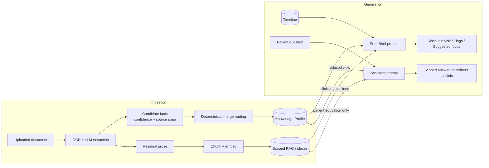
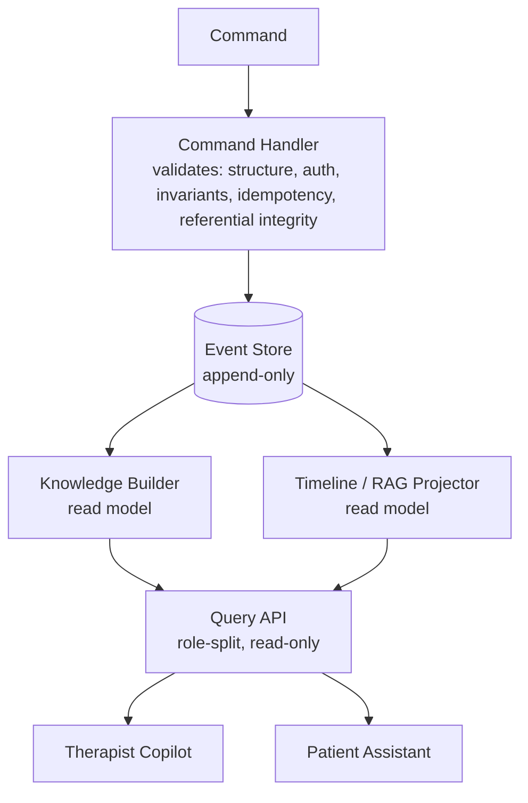

# Scaffold Health

A clinical knowledge platform for orthopedic/MSK rehab clinics (initial wedge: ACL reconstruction). It turns scattered clinical documents, therapist notes, and patient check-ins into a single structured, provenance-tracked **Patient Knowledge Profile**, and uses that record to power a **Therapist Copilot** and a **Patient Assistant**. The system is advisory-only — the therapist is always the sole clinical decision-maker; no AI output writes directly to a patient's care plan.

## Problem Statement

Rehab clinics accumulate paperwork — MRI reports, discharge summaries, referral notes — and check-in data per patient, but it stays unstructured and scattered across documents. Therapists re-read a patient's full history before every appointment, with no structured, provenance-tracked view of what is actually known about a patient's condition and progress. Existing digital MSK products (Hinge Health, Sword Health) focus on exercise tracking and motion capture for high-volume, low-acuity chronic pain — not on the documentation and clinical-reasoning burden of structured, surgeon-referred, protocol-driven recovery. Scaffold Health targets that gap directly.

## AI Workflow

Two AI paths run through the same document and knowledge foundation: **ingestion** (turning documents into structured, provenance-tracked facts) and **generation** (turning that structured knowledge into clinician- or patient-facing answers).



The LLM never decides how a conflict between facts is resolved — merge routing is fixed, deterministic logic keyed by field name. Only unstructured prose is ever embedded; structured fields, identifiers, and derived values never enter a RAG index.

## System Architecture

Event-sourced CQRS: the **event store is the sole source of truth**. The Knowledge Profile, Timeline, and RAG indexes are disposable, rebuildable projections — never written to directly.



| Service | Role |
|---|---|
| `api` (FastAPI) | Command handlers, query API, HTTP surface |
| `worker` (Celery) | Async OCR/LLM extraction, embedding |
| `db` (PostgreSQL + pgvector) | Event store, projections, vector indexes |
| `redis` | Celery broker/backend |
| `frontend` (React + Vite) | Therapist dashboard, patient portal |

## Data Flow

1. A therapist uploads a document; a command validates and appends an `UploadDocument` event.
2. An async worker OCRs the file and runs LLM extraction, returning candidate facts with confidence scores and source spans.
3. Deterministic Python logic — not the LLM — routes each field to its merge strategy (overwrite, append-only, derived, or immutable-once-set) and applies it, writing full provenance (`source_event_id`, `extracted_at`, `confidence`, `extractor_version`).
4. A new Knowledge Profile version is created, referencing the causing event — no in-place mutation.
5. Residual unstructured text (after fact extraction) is chunked, embedded, and written into the appropriate scoped RAG index.
6. On a "Generate prep brief" request, the system assembles the full Knowledge Profile, Timeline events since the last brief, and relevant clinical-guideline RAG chunks into a single structured LLM prompt.
7. The LLM returns a three-section brief (Since last visit / Flags / Suggested focus), rendered inline — advisory-only, never written back to the profile.

## Design Decisions

- **Event-sourced CQRS with an append-only event store** — gives a full audit trail and point-in-time replay; read models (Knowledge Profile, Timeline, RAG indexes) are disposable and rebuildable rather than sources of truth.
- **Deterministic merge routing, never the LLM** — clinical-fact arbitration stays auditable and reproducible; contradictions are always flagged with a specific reason, never silently resolved.
- **pgvector, co-located with Postgres, as three separately scoped RAG indexes** (per-patient notes, clinical guidelines, patient education) — avoids a separate vector-store dependency, and structural scoping keeps patient data, clinician-only content, and patient-facing content from leaking across corpora.
- **Structurally separate query API modules** (`query_api/therapist.py` vs `query_api/patient.py`) instead of one endpoint with role-based filtering — the advisory-only, never-autonomous posture is enforced by code structure, not convention.
- **Provider-agnostic LLM client** (`app/core/llm_client.py`) — the LLM provider is swappable behind a fixed `extract_facts` / `generate_brief` interface.

## Known Limitations

- Advisory-only by design: no AI output ever writes directly to a care plan; the therapist is always the sole clinical decision-maker.
- Single-clinic deployment model — no multi-tenant support.
- No computer-vision motion tracking or exercise-form analysis; that is a deliberately different product category.
- No real email delivery infrastructure — invite links are shared manually by the therapist.
- Built for synthetic data: production-grade PHI handling (BAA-covered LLM hosting, at-rest/in-transit encryption posture, full HIPAA-style audit logging) is a defined future requirement, not a current guarantee.
- Scope ceiling is orthopedic/MSK rehab only — permanent, not a temporary constraint.

## Roadmap

| Phase | Scope |
|---|---|
| **Phase 1** | ACL reconstruction rehab: event-sourced architecture, Knowledge Builder, Timeline, Therapist Copilot, Patient Assistant, RAG, extraction evaluation loop |
| **Phase 2** | Additional orthopedic/MSK protocols — knee replacement, hip replacement, shoulder, sports rehab, lower back pain — same architecture, new protocol configs (field schemas, phase definitions, eval sets, RAG corpora) per injury type |
| **Phase 3** | Out of scope — no expansion beyond orthopedic/MSK rehab is planned |

## Documentation

- [Product Requirements Document](docs/PRD.md) — full problem statement, workflows, and Definition of Done
- [System Architecture](docs/PRD.md#6-system-architecture) — CQRS pattern, command validation, merge strategy, RAG scoping
- [AI/LLM Architecture](docs/PRD.md#9-aillm-requirements) — extraction, merge routing, and Copilot prompt design
- [Data Model & Merge Strategy](docs/PRD.md#63-knowledge-builder-merge-strategy-per-field) — per-field merge strategies and provenance
- [API Surface](docs/PRD.md#72-api-surface) — endpoint reference (live interactive docs also served at `/docs` when the API is running)

## Quick start

```
cp .env.example .env
docker compose up --build
```

- Frontend: http://localhost:5173 (Vite dev server; proxies `/api/*` to the API)
- API: http://localhost:8000 (`GET /health`)
- Postgres: localhost:5433
- Redis: localhost:6380

Run the backend test suite:

```
docker compose exec api python -m pytest
```
